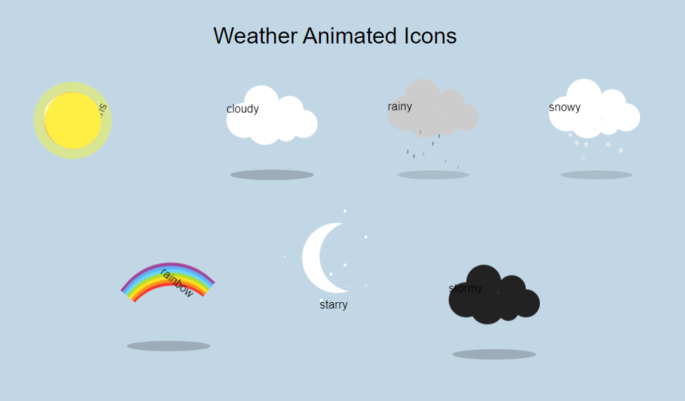

# Animated weather icons

An animated weather icons for the various weather conditions. It is built with HTML AND CSS

# Technology used

HTML and CSS (flex box, keyfram animations, etc)

## Screenshots

## Authors

- [@giftednathan](https://www.github.com/giftednathan)

# Hi, I'm Katherine! 👋

## 🚀 About Me
I'm a frontend developer, a graphics designer and a content writer

## 🛠 Skills
React, Javascript, HTML, CSS...

## 🔗 Links

## Support

For support, email eje.nathaniel@gmail.com

## Thank you